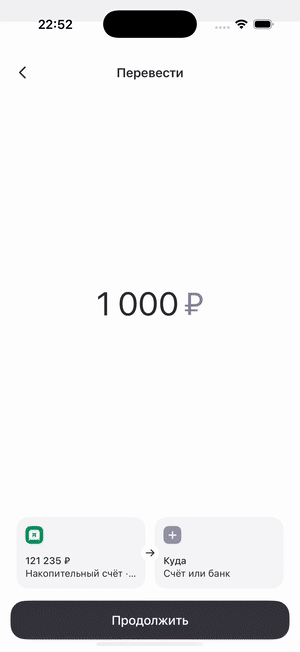
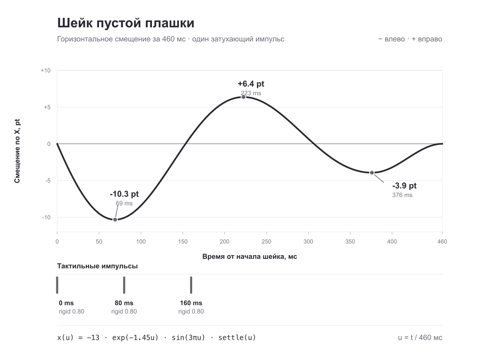

# Перенос счёта: пружинный отклик пустого поля

Спецификация прототипа «Между счетами · переход». Исходное состояние: накопительный счёт выбран в «Откуда», «Куда» пусто. Обратное направление работает симметрично. [Образец структуры описания в Figma](https://www.figma.com/design/PEi0USoqsPEnuuURAIMveL/?node-id=58793-52879).

## 1. Анимация

При выборе счёта, уже стоящего в другом поле, он переносится в выбранное поле, прежнее поле становится пустым и один раз пружинит по горизонтали; перенос сопровождают три коротких тактильных удара.



[Запись экрана 1×](media/between-accounts-transition-1x.mp4) · [Тот же фрагмент 0,25×](media/between-accounts-transition-quarter-speed.mp4). Видео записано в iPhone Simulator; тактильную отдачу в нём нельзя почувствовать, поэтому её параметры описаны ниже отдельно.

## 2. По шагам

Время **T** отсчитывается от выбора в шите того же счёта, который уже находится в противоположном поле. Время **S = T − 180 мс** отсчитывается от начала шейка. Значения смещения даны в **pt**: минус — влево, плюс — вправо. Для переноса из «Куда» в «Откуда» порядок тот же, но пружинит освободившееся «Куда».

| T от выбора | S от шейка | Состояние и движение пустой плашки | Хаптик |
| ---: | ---: | --- | --- |
| 0 мс | — | Выбранный счёт сразу назначается целевому полю, прежнее поле очищается; шит начинает закрываться (`.snappy`, 200 мс). | Нет дополнительного удара выбора. |
| 180 мс | 0 мс | Начинается один горизонтальный пружинный импульс длительностью 460 мс. `x = 0`. | Удар 1: `.rigid`, `0.8`. |
| ≈249 мс | ≈69 мс | Первый и самый сильный уход влево: `x ≈ −10,33 pt`. | — |
| 260 мс | 80 мс | Плашка уже движется вправо; `x ≈ −10,08 pt`. | Удар 2: `.rigid`, `0.8`. |
| ≈313 мс | ≈133 мс | Иконка пустого поля достигает наибольшего масштаба: ≈`1,049×`. | — |
| ≈333 мс | ≈153 мс | Первый проход через исходную позицию: `x = 0`. | — |
| 340 мс | 160 мс | Продолжается ход вправо: `x ≈ +1,07 pt`. | Удар 3: `.rigid`, `0.8`. |
| ≈403 мс | ≈223 мс | Правый пик меньше первого: `x ≈ +6,37 pt`. | — |
| ≈460 мс | ≈280 мс | Масштаб иконки вернулся к `1×`. | — |
| ≈487 мс | ≈307 мс | Второй проход через центр: `x = 0`. | — |
| ≈556 мс | ≈376 мс | Последний, ещё меньший уход влево: `x ≈ −3,93 pt`. | — |
| 640 мс | 460 мс | Плашка вернулась в `x = 0`; движение закончено. | — |
| 660 мс | 480 мс | Прогресс сбрасывается в `0` **без анимации**, чтобы не возникла вторая волна. | — |

Шит и изменение выбранных счетов анимируются своим `.snappy(duration: 0.2)`. Шейк стартует спустя 180 мс после выбора, поэтому последние 20 мс закрытия шита могут совпадать с его началом. Таймлайн относится к переносу **того же** счёта; при выборе другого счёта пружинного и тройного тактильного отклика нет.

## 3. Детали реализации

**Состояние.** Если ID выбранного счёта совпадает с ID в противоположном поле, этот счёт назначается полю, по которому открыли шит, а противоположное поле очищается. Пружинит только что опустевшее поле. Сам счёт не должен одновременно остаться в обоих полях.

**Смещение.** Анимируется только `translationX` всей пустой плашки. Время `S` идёт линейно от 0 до 460 мс, а нелинейную траекторию задаёт функция:

```text
u = clamp(S / 460, 0, 1)
spring = -13 * exp(-1.45 * u) * sin(3 * pi * u)
settle = u < 0.82 ? 1 : max(0, 1 - ((u - 0.82) / 0.18)^2)
translationX = spring * settle  // pt
```

Это **один** затухающий импульс «влево → вправо → влево → центр», без паузы и повторного цикла. Контрольные значения для сверки рендера:

| S, мс | 0 | 50 | 100 | 153,3 | 200 | 222,5 | 300 | 306,7 | 375,9 | 420 | 460 |
| ---: | ---: | ---: | ---: | ---: | ---: | ---: | ---: | ---: | ---: | ---: |
| X, pt | 0 | −9,49 | −8,42 | 0 | +5,65 | +6,37 | +0,69 | 0 | −3,93 | −1,85 | 0 |

**Микроотклик пустого поля.** Иконка увеличивается максимум примерно до `1,049×` на `S ≈ 133 мс` и возвращается к `1×` к `S ≈ 280 мс`. Это изменение относится только к пустой плашке; сумма и другая плашка не дрожат.

**Хаптик.** Три одинаковых `UIImpactFeedbackGenerator(style: .rigid)` с `impactOccurred(intensity: 0.8)` на `S = 0, 80, 160 мс`. Не растягивать интервалы, не ослаблять последний удар, не добавлять четвёртый импульс или `UINotificationFeedbackGenerator`. Генератор желательно подготовить через `prepare()` перед серией и после ударов. На физическом iPhone проверить тактильный ритм отдельно: симулятор воспроизводит только картинку.

## 4. Плавность



У всей траектории нет одной пары контрольных точек Безье: она трижды меняет направление. Для движка с keyframes есть [шесть кубических сегментов и абсолютные контрольные точки](bezier-points.md), а также [те же ключевые данные в JSON](bezier-points.json). Это приближение исходной функции с ошибкой около `0,13 pt`; при возможности лучше вычислять формулу напрямую. График также доступен в [SVG](motion-curve.svg).

## Проверка

- Выбор того же счёта в «Куда» освобождает «Откуда»; выбор в обратном направлении освобождает «Куда».
- На освободившемся поле ровно один шейк за 460 мс и ровно три равных удара через 80 мс.
- Поле и счёт после анимации не меняют назначение ещё раз; повторной волны нет.
- Запуск прототипа: `-demoOpen groups-work/between-accounts-transition`.

Исходная реализация: `WBSandbox/Screens/UniQRScreen.swift` (`selectTransferAccount`, `playSlotAttention`, `UniQRPremiumAttentionEffect`).
