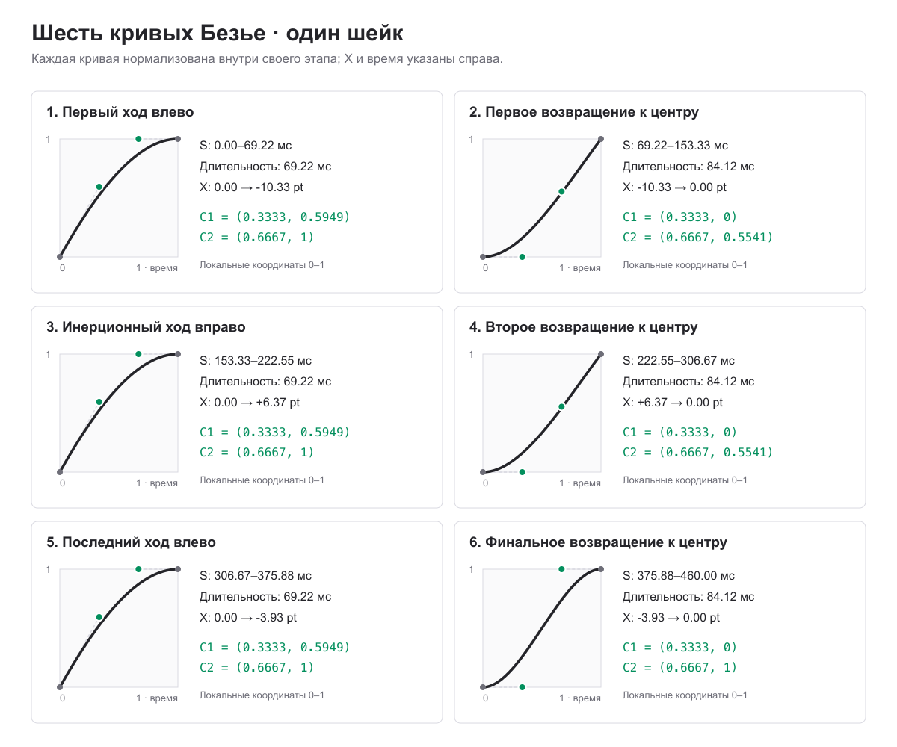

# Кривые Безье: шейк пустой плашки

Плашка смещается только по X. Шейк начинается через **180 мс после выбора счёта** и занимает **460 мс**: шесть последовательных этапов без пауз. Время в таблице отсчитывается от начала шейка; отрицательное X означает движение влево. Смещения указаны в **pt**, не в пикселях экрана.

## Этапы движения

Координаты в `cubic-bezier(x1, y1, x2, y2)` нормализованы **внутри каждого этапа**: локальное время и путь идут от `(0, 0)` до `(1, 1)`. Это управляющие точки easing-функции, не координаты плашки на экране. Её фактическое положение задаётся столбцом X.

| № | Этап | Время от старта, мс | Длительность, мс | X, pt | `cubic-bezier(x1, y1, x2, y2)` |
| ---: | --- | ---: | ---: | --- | --- |
| 1 | Первый ход влево | 0–69.216 | 69.216 | 0 → −10.330 | `(0.3333, 0.5949, 0.6667, 1)` |
| 2 | Первое возвращение к центру | 69.216–153.333 | 84.117 | −10.330 → 0 | `(0.3333, 0, 0.6667, 0.5541)` |
| 3 | Инерционный ход вправо | 153.333–222.549 | 69.216 | 0 → +6.371 | `(0.3333, 0.5949, 0.6667, 1)` |
| 4 | Второе возвращение к центру | 222.549–306.667 | 84.118 | +6.371 → 0 | `(0.3333, 0, 0.6667, 0.5541)` |
| 5 | Последний ход влево | 306.667–375.883 | 69.216 | 0 → −3.929 | `(0.3333, 0.5949, 0.6667, 1)` |
| 6 | Финальное возвращение к центру | 375.883–460 | 84.117 | −3.929 → 0 | `(0.3333, 0, 0.6667, 1)` |

Шестой этап заканчивается в исходной позиции; второй волны движения нет. Длительности этапов уже входят в общие 460 мс.

## Передача в анимационный движок

Для `CAKeyframeAnimation` задайте длительность `0.46` с и анимируйте горизонтальный сдвиг, например `transform.translation.x`. `keyTimes` получаются из нуля и концов всех шести этапов, делённых на `460`; `values` — из начального X и конечного X каждого этапа. На каждый из шести интервалов приходится одна `CAMediaTimingFunction` из таблицы в том же порядке. Не применяйте дополнительный easing ко всей 460-мс анимации.

Параметры этапов для импорта доступны в [JSON](bezier-points.json). Сценарий и хаптики описаны в [основной спецификации](README.md).
